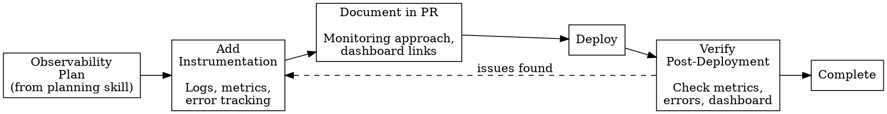

# Observability Implementation

## Overview

**Add monitoring as you build features, not after.**

This skill guides you through implementing observability: adding instrumentation to code, documenting monitoring in PRs, and verifying it works post-deployment.

**Core principle:** Observability is part of "done" - shipped code includes monitoring for both success and failure.

**Use this skill with:** `observability-planning` (to know what to monitor)

## When to Use

Use during:
- **Implementation** - Adding instrumentation alongside feature code
- **PR creation** - Documenting observability approach
- **Post-deployment** - Verifying monitoring works as expected
- **Refactoring** - Maintaining or improving existing observability

## Implementation Workflow



## Phase 1: Add Instrumentation

**Instrument at boundaries and critical decision points.**

### What to Instrument

**Always instrument:**
- API endpoints (entry/exit points)
- Database operations (writes, critical reads)
- External service calls
- Critical business logic

**Instrument selectively:**
- Background jobs (start, completion, failure)
- User actions (if tracking engagement)
- Feature flag evaluations (if debugging rollouts)
- Cache operations (if performance-critical)

**Don't instrument:**
- Every helper function
- Internal state changes (unless debugging specific issue)
- Pure computation with no side effects

**Rule:** Instrument at **boundaries** and **decision points**, not everywhere.

### Flexible Implementation Patterns

**Use available tools pragmatically:**

#### Error Tracking (prefer Sentry when available)

```javascript
// With Sentry (ideal)
import * as Sentry from '@sentry/node';

try {
  const result = await savePreferences(userId, data);
  return result;
} catch (error) {
  Sentry.captureException(error, {
    tags: {
      user_id: userId,
      operation: 'save_preferences',
      error_type: error.name
    },
    contexts: {
      request: { data }
    }
  });
  throw error;
}

// Without Sentry (fallback)
// Use structured logging with adequate context
logger.error('Failed to save preferences', {
  userId,
  operation: 'save_preferences',
  error: error.message,
  stack: error.stack,
  data
});
```

#### Metrics (prefer Datadog when available)

```javascript
// With Datadog (ideal)
import StatsD from 'hot-shots';
const statsd = new StatsD();

// Track requests
statsd.increment('user_preferences.requests', {
  endpoint: 'save'
});

// Track errors
if (error) {
  statsd.increment('user_preferences.errors', {
    error_type: 'validation'
  });
}

// Track performance
const timer = Date.now();
await operation();
statsd.timing('user_preferences.duration', Date.now() - timer);

// Without Datadog (fallback)
// Use structured logging with metrics-like data
logger.info('user_preferences.requests', { endpoint: 'save', count: 1 });
logger.info('user_preferences.duration', { duration_ms: Date.now() - timer });
// Can be parsed later for metrics
```

#### Logging (always available)

```javascript
// Best practice: Structured logging with context
logger.info('Saving user preferences', {
  userId,
  operation: 'save_preferences',
  preferences: { emailNotifications, pushNotifications }
});

// On success
logger.info('Successfully saved preferences', {
  userId,
  operation: 'save_preferences'
});

// On error (with context)
logger.error('Failed to save preferences', {
  userId,
  operation: 'save_preferences',
  error: error.message,
  errorType: error.name,
  stack: error.stack
});
```

### Example: Instrumented API Endpoint

```javascript
import express from 'express';
import * as Sentry from '@sentry/node';
import StatsD from 'hot-shots';
import logger from './logger';

const router = express.Router();
const statsd = new StatsD();

router.post('/api/v1/user-preferences', async (req, res) => {
  const startTime = Date.now();
  const userId = req.body.user_id;

  // Add context for error tracking
  Sentry.setTag('user_id', userId);
  Sentry.setTag('operation', 'save_preferences');

  // Log request
  logger.info('Saving user preferences', {
    userId,
    operation: 'save_preferences',
    preferences: {
      email: req.body.email_notifications,
      push: req.body.push_notifications
    }
  });

  // Track request metric
  statsd.increment('user_preferences.requests', {
    endpoint: 'save'
  });

  try {
    // Validate
    const validationResult = validatePreferences(req.body);
    if (!validationResult.valid) {
      // Track validation failures
      statsd.increment('user_preferences.validation_failures', {
        field: validationResult.field
      });

      logger.warn('Validation failed', {
        userId,
        field: validationResult.field,
        error: validationResult.error
      });

      return res.status(400).json({ error: validationResult.error });
    }

    // Save to database
    const preferences = await saveToDatabase(userId, req.body);

    // Track success
    statsd.increment('user_preferences.success', {
      operation: 'save'
    });

    // Track duration
    statsd.timing('user_preferences.duration', Date.now() - startTime);

    logger.info('Successfully saved preferences', {
      userId,
      operation: 'save_preferences',
      duration_ms: Date.now() - startTime
    });

    return res.status(201).json(preferences);

  } catch (error) {
    // Track error
    statsd.increment('user_preferences.errors', {
      error_type: error.name
    });

    // Capture in Sentry with context
    Sentry.captureException(error, {
      tags: {
        error_type: error.name
      },
      contexts: {
        request: { body: req.body }
      }
    });

    // Log error
    logger.error('Failed to save preferences', {
      userId,
      operation: 'save_preferences',
      error: error.message,
      errorType: error.name,
      stack: error.stack,
      duration_ms: Date.now() - startTime
    });

    return res.status(500).json({ error: 'Internal server error' });
  }
});
```

### Instrumentation Checklist

**For each meaningful change:**
- [ ] Added logging at API boundaries (entry/exit)
- [ ] Added error tracking (Sentry if available, else structured logs)
- [ ] Added success/failure metrics (Datadog if available, else log metrics)
- [ ] Added performance timing for operations
- [ ] Added context tags (user_id, operation, etc.)
- [ ] Validated error scenarios have proper instrumentation

## Phase 2: Document in PR

**Every PR with meaningful changes needs observability documentation.**

### Required PR Section

```markdown
## Observability

### Infrastructure Used
- **Error Tracking:** Sentry (`frontend-mono-repo` project)
- **Metrics:** Datadog
- **Logging:** Winston with Datadog Logs
- **Dashboard:** [Link to dashboard or "Added to existing dashboard"]

### What's Instrumented

Brief description of what was added:
- API endpoint tracking (requests, errors, duration)
- Validation failure metrics by field
- Database operation errors
- Success/failure rates

### Key Metrics

- `user_preferences.requests` - Total API requests
  - Tags: `endpoint:save|update|delete`
  - Expected: 100-200 req/min initially

- `user_preferences.success` - Successful operations
  - Expected rate: > 95%

- `user_preferences.validation_failures` - Input validation errors
  - Tags: `field:<field_name>`
  - Expected rate: < 5% of requests

- `user_preferences.errors` - System errors
  - Tags: `error_type:<type>`
  - Alert threshold: > 1%

- `user_preferences.duration` - API response time
  - Target: p95 < 200ms

### Error Tracking

**Sentry Configuration:**
- Project: `frontend-mono-repo`
- Tags: `user_id`, `operation`, `error_type`
- Expected errors: Validation failures (400s) are user errors, not system issues

**Alert on:**
- Any 500 errors → Page on-call
- Error rate > 5% → Warning notification

### Dashboard

- **Location:** [Link to Datadog dashboard]
- **Panels added:**
  - Request volume over time
  - Success rate
  - Error rate by type
  - p95 latency
  - Validation failures by field

### Post-Deployment Verification

After deployment, verify:
- [ ] No unexpected errors in Sentry (last hour)
- [ ] Metrics reporting correctly in Datadog
- [ ] Dashboard shows expected patterns
- [ ] Request volume matches expectations
- [ ] Latency within target range
```

### Minimal PR Section (Small Changes)

For smaller changes leveraging existing observability:

```markdown
## Observability

**Instrumentation:** Leveraging existing `user_preferences.*` metrics and Sentry integration.

**Changes:** Added `user_preferences.field_updated` metric to track which fields are commonly modified.

**Verification:** Post-deployment, check [Dashboard](link) for new metric reporting.
```

### PR Section for Infrastructure Gaps

If observability infrastructure isn't available:

```markdown
## Observability

### Current State
- ⚠️ **No Sentry integration** - Need to set up error tracking
- ✅ **Datadog configured** - Metrics added
- ⚠️ **Basic logging only** - Using console.log (should migrate to structured logging)

### What's Implemented
- Datadog metrics for requests, errors, duration
- Console logging with JSON structure (can parse later)

### Recommended Follow-up
- [ ] Set up Sentry integration for error tracking
- [ ] Migrate to structured logging library (Winston/Pino)
- [ ] Create dashboard for these metrics

### Post-Deployment Verification
- [ ] Verify metrics in Datadog
- [ ] Monitor logs for errors (manual review needed without Sentry)
```

## Phase 3: Post-Deployment Verification

**After deployment, confirm observability is working.**

### Verification Steps

**1. Check for new errors (if Sentry available):**

```bash
# Use MCP tool to search recent issues
# Tool: mcp__sentry__search_issues
# Parameters:
#   - projects: [your-project]
#   - query: "firstSeen:>={deployment_time}"
#   - limit: 50

# What to look for:
# - Unexpected error types
# - High volume of errors
# - Errors without proper context tags
```

**2. Verify metrics reporting (if Datadog available):**

```bash
# Use MCP tool to search for metrics
# Tool: mcp__datadog__search_datadog_metrics
# Query: "user_preferences.*"

# Verify:
# - All expected metrics present
# - Metrics showing data from deployment time forward
# - Values in expected ranges
```

**3. Check dashboard:**

```bash
# Use MCP tool to get metric data
# Tool: mcp__datadog__get_datadog_metric
# Metric: "user_preferences.requests"
# Time range: Last 1 hour

# Verify:
# - Request volume matches expectations
# - Error rate within acceptable range
# - Latency within target range
# - No anomalies/spikes
```

**4. Compare baseline:**

Check if deployment changed error rates or performance:
- Error rate before deployment
- Error rate after deployment
- Should be stable (no significant increase)

### Document Verification Results

Add comment to PR or deployment tracking:

```markdown
## Post-Deployment Verification - [Timestamp]

### Sentry ✅
- **Errors:** 3 validation errors (expected), 0 system errors
- **Context:** All errors have proper user_id and operation tags
- **Volume:** ~2% validation failures (within < 5% threshold)

### Datadog ✅
- **Request volume:** ~45 req/min (expected range: 40-60)
- **Success rate:** 98.2% (target: > 95%) ✅
- **p95 latency:** 132ms (target: < 200ms) ✅
- **Error rate:** 0.1% (excluding validation, target: < 1%) ✅

### Dashboard ✅
- All metrics reporting correctly
- No anomalies detected
- [Dashboard Link](url)

### Issues Found
None - deployment successful with expected behavior.
```

OR if issues found:

```markdown
## Post-Deployment Verification - [Timestamp]

### Issues Found ⚠️

1. **Missing metric:** `user_preferences.db_duration` not reporting
   - **Cause:** Metric name typo in code
   - **Fix:** [Link to fix PR]

2. **High validation failures:** 15% (expected < 5%)
   - **Cause:** Frontend sending unexpected field format
   - **Action:** Investigating with frontend team

### Working Correctly ✅
- Error tracking in Sentry
- Request volume metrics
- Success rate tracking
```

### Verification Checklist

**Post-deployment, verify:**
- [ ] No unexpected errors in error tracking (Sentry or logs)
- [ ] All expected metrics reporting (Datadog or equivalent)
- [ ] Dashboard accessible and showing data
- [ ] Metric values in expected ranges
- [ ] Error rates stable compared to pre-deployment
- [ ] Latency within target thresholds
- [ ] All error context tags present

**If issues found:**
- [ ] Documented in verification results
- [ ] Created follow-up tasks/tickets
- [ ] Notified relevant stakeholders

## Common Implementation Mistakes

| Mistake | Why It Happens | Fix |
|---------|---------------|-----|
| Instrumenting every function | "More metrics = better visibility" | Instrument boundaries and decision points only |
| No context in errors | "Error message is enough" | Always add user_id, operation, request context |
| Logging sensitive data | "Need full context for debugging" | Sanitize PII, credentials, tokens from logs |
| Inconsistent tag names | "user-id" vs "userId" vs "user_id" | Follow existing conventions, use snake_case for Datadog |
| Skipping post-deployment verification | "Deployment succeeded = done" | Always verify metrics actually reporting |
| No PR documentation | "Obvious what's monitored" | Document for reviewers and future reference |
| Infrastructure not available but didn't document | "Will set up later" | Document gaps and create follow-up tasks |

## Handling Infrastructure Gaps

**If Sentry not available:**
- Use structured logging for errors
- Include full context (user_id, operation, stack trace)
- Document need for error tracking setup
- Create follow-up task

**If Datadog not available:**
- Use structured log lines that look like metrics
- Format: `logger.info('metric_name', { value: 1, tags: {...} })`
- Can be parsed later into actual metrics
- Document need for metrics infrastructure

**If no structured logging:**
- Use JSON.stringify for structured output
- At minimum, include context in log messages
- Document need for logging library

**Always document gaps so they can be addressed later.**

## Proportional Instrumentation

**Match instrumentation to change scope:**

| Change Size | Instrumentation Level |
|-------------|----------------------|
| New service/API | Full: logs, metrics, errors, dashboard |
| New endpoint in existing API | Add to existing patterns, extend dashboard |
| New field in endpoint | Minimal: maybe add field-specific metric if important |
| Bug fix | Verify existing instrumentation covers it |
| Refactor (identical behavior) | Maintain existing instrumentation |
| Performance optimization | Must measure before/after |

## Real-World Impact

**With implementation discipline:**
- Features ship with monitoring built-in
- Production issues debuggable immediately
- Can measure feature success from day one
- Verification catches instrumentation bugs before users do

**Without implementation:**
- Flying blind in production
- Hours spent adding instrumentation reactively
- Can't measure success or debug issues
- Users report problems before you see them

**Time cost:** 10-15 minutes per feature to instrument
**Time saved:** Hours per incident with proper context
