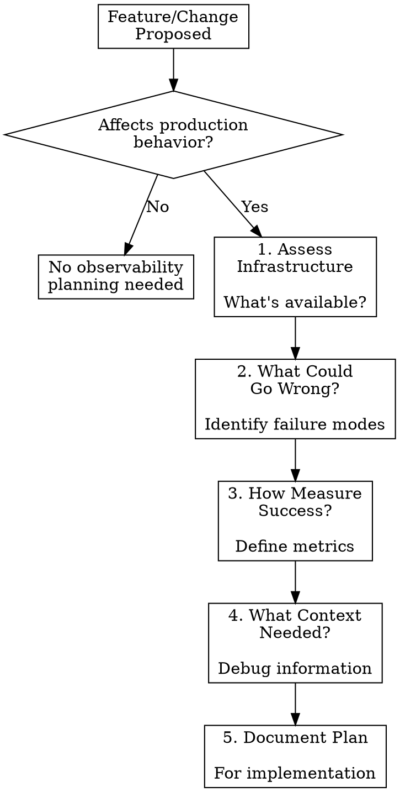

# Observability Planning

## Overview

**Before implementing meaningful changes, answer: "How will we know if this works (or breaks) in production?"**

This skill helps you plan observability during the design phase - before writing code. It identifies what to monitor, assesses available infrastructure, and defines success criteria.

**Core principle:** Planning observability upfront is cheaper than debugging blind in production.

**Use this skill with:** `observability-implementation` (for actually adding instrumentation)

## When to Use

Use during planning for:
- **New features** (APIs, UI workflows, data flows)
- **Significant changes** (refactors that touch critical paths, performance optimizations)
- **Integration work** (third-party services, microservice interactions)
- **Bug fixes** (especially if current observability is inadequate)

Skip for:
- Typos, formatting, documentation-only changes
- Changes where existing observability clearly covers the new behavior

## The Planning Questions



## 1. Assess Infrastructure

**Before planning what to monitor, understand what's available.**

### Check Available Tools:

```bash
# Check for Datadog metrics
# Use: mcp__datadog__search_datadog_metrics
# Look for: Existing metrics in this project/service

# Check for Sentry projects
# Use: mcp__sentry__find_projects
# Look for: Which project would track errors for this code

# Search codebase for existing instrumentation
# Use: Grep for common patterns
# Patterns: "logger.", "statsd.", "capture_exception", "set_tag"
```

### Questions to Answer:

1. **What error tracking is available?**
   - Is Sentry configured? Which project?
   - Other error tracking (e.g., CloudWatch, custom)?
   - None available?

2. **What metrics infrastructure exists?**
   - Is Datadog configured?
   - Other metrics (Prometheus, CloudWatch, custom)?
   - None available?

3. **What logging is in place?**
   - Structured logging library?
   - Log aggregation (Datadog Logs, CloudWatch, etc.)?
   - Just stdout?

4. **What dashboards exist?**
   - Are there existing dashboards for this service/component?
   - Can we add to existing dashboards?
   - Need to create new ones?

### Infrastructure Assessment Result:

Document what's available:
```markdown
## Observability Infrastructure

**Error Tracking:** Sentry project `frontend-mono-repo` (configured ✅)
**Metrics:** Datadog (configured ✅)
**Logging:** Winston with Datadog Logs integration (configured ✅)
**Dashboards:** [Service Dashboard](link) exists, can add metrics
```

OR if gaps exist:
```markdown
## Observability Infrastructure

**Error Tracking:** ⚠️ No Sentry configuration found
**Metrics:** Datadog (configured ✅)
**Logging:** Console.log only ⚠️ (no structured logging)
**Dashboards:** None exist for this service

**Gaps to address:**
- Set up Sentry integration
- Add structured logging library
- Create initial dashboard
```

## 2. What Could Go Wrong?

**Identify failure scenarios that need monitoring.**

### Common Failure Modes by Change Type:

| Change Type | Potential Failures to Monitor |
|-------------|------------------------------|
| New API endpoint | Validation failures, auth failures, database errors, timeouts, rate limiting |
| Database changes | Write failures, constraint violations, migration errors, performance degradation |
| External API integration | API errors, timeouts, rate limiting, invalid responses, network issues |
| User flow changes | Drop-offs, validation errors, unexpected paths, performance issues |
| Performance optimization | Regressions, new bottlenecks, edge case performance |
| Bug fix | Fix doesn't work, fix introduces new issues, edge cases still broken |

### Template Questions:

1. **Input validation:** What invalid inputs might users send?
2. **External dependencies:** What if external service fails/is slow?
3. **Data integrity:** What if data is in unexpected state?
4. **Edge cases:** What unusual conditions should we track?
5. **Performance:** What operations might be slow?

### Document Failure Scenarios:

```markdown
## Failure Scenarios to Monitor

1. **Validation failures** - User sends invalid preference values
   - Monitor: Validation error rates by field
   - Alert: If > 10% of requests fail validation

2. **Database write failures** - Database unavailable or constraint violation
   - Monitor: Database error rates
   - Alert: If any database errors occur

3. **Concurrent update conflicts** - User updates preferences simultaneously
   - Monitor: Optimistic lock failures
   - Alert: If > 1% of requests have conflicts
```

## 3. How to Measure Success?

**Define metrics that indicate the feature is working correctly.**

### Success Metric Categories:

**Adoption metrics:**
- Request volume (how many users/requests?)
- Unique users (how many distinct users?)
- Feature flag rollout (% of users enabled)

**Health metrics:**
- Success rate (% of requests that succeed)
- Error rate (% that fail, by error type)
- Validation failure rate (user errors vs system errors)

**Performance metrics:**
- Response time (p50, p95, p99)
- Database query duration
- External API call duration

**Business metrics:**
- Conversion rate (for user flows)
- Engagement metrics (for features)
- Data quality (for data operations)

### Document Success Metrics:

```markdown
## Success Metrics

### Adoption
- `user_preferences.requests.count` - Total requests (expect: 100-200/min initially)
- `user_preferences.unique_users` - Distinct users using feature

### Health
- `user_preferences.success_rate` - Should be > 95%
- `user_preferences.errors.count` by `error_type` - Track system vs validation errors
- `user_preferences.validation_failures` by `field` - Identify problematic fields

### Performance
- `user_preferences.duration` - API response time (target: p95 < 200ms)
- `user_preferences.db_duration` - Database operation time (target: p95 < 50ms)

### Alerts
- Error rate > 5% (excluding validation) → Page on-call
- p95 latency > 500ms → Warning notification
- Request volume drops > 50% → Warning (possible issue)
```

## 4. What Context for Debugging?

**Identify information needed to debug issues when they occur.**

### Essential Context:

**User identification:**
- User ID (always include if applicable)
- Session ID / Request ID
- Feature flag state (if relevant)

**Request context:**
- Request parameters (sanitized)
- API endpoint / action
- Client information (version, platform)

**System context:**
- Service version / commit SHA
- Environment (production, staging)
- Region / availability zone

**Business context:**
- Organization ID / Tenant ID
- Subscription tier
- Experiment variants

### Document Required Context:

```markdown
## Debug Context

**Tags for all logs/errors:**
- `user_id` - For user-specific investigation
- `operation` - What action was attempted (save, update, delete)
- `endpoint` - API endpoint called
- `environment` - production/staging

**Additional context for errors:**
- Request body (sanitized - no PII)
- Database transaction ID (if applicable)
- Feature flag states (if relevant)

**Sentry breadcrumbs:**
- API calls made
- Database queries executed
- Validation steps performed
```

## 5. Document the Plan

**Capture the observability plan for implementation.**

### Template:

```markdown
## Observability Plan for [Feature Name]

### Infrastructure
- **Error Tracking:** [Tool] - Project: [project-name]
- **Metrics:** [Tool] - Namespace: [namespace]
- **Logging:** [Tool/Library]
- **Dashboard:** [Link or "Create new"]

### What We'll Monitor

**Failure Scenarios:**
1. [Scenario] - Monitor: [metric/log] - Alert: [condition]
2. [Scenario] - Monitor: [metric/log] - Alert: [condition]

**Success Metrics:**
- [Metric name] - Expected: [range/threshold]
- [Metric name] - Expected: [range/threshold]

**Performance:**
- [Metric name] - Target: [threshold]

### Context to Capture
- [Tag name]: [Purpose]
- [Tag name]: [Purpose]

### Instrumentation Points
- [Location in code]: [What to instrument]
- [Location in code]: [What to instrument]

### Dashboard Plan
- Add metrics to [existing dashboard] OR
- Create new dashboard with panels for: [list]

### Gaps / Follow-up
- [ ] [Any infrastructure setup needed]
- [ ] [Any tooling configuration needed]
```

## Common Planning Mistakes

| Mistake | Why It Happens | Fix |
|---------|---------------|-----|
| Planning too much instrumentation | "Monitor everything!" | Focus on boundaries and critical decision points |
| No concrete thresholds | "We'll see what's normal" | Define expected ranges based on similar features |
| Ignoring existing patterns | "Start fresh" | Check how similar features are instrumented |
| Planning without infrastructure check | "Assume tools are available" | Always assess first - might need setup |
| No thought about context | "Error message is enough" | Plan tags/context for filtering and debugging |
| Vague failure scenarios | "If something breaks" | Be specific: what breaks, how to detect |

## When to Skip Detailed Planning

**Quick observability planning is fine for:**
- Small additions to well-instrumented services
- Changes that clearly fit existing patterns
- Bug fixes in areas with adequate observability

**Full planning needed for:**
- New services/components
- First feature in an area
- Changes with unclear failure modes
- Performance-critical code

## Outputs

After using this skill, you should have:

1. ✅ **Infrastructure assessment** - What tools are available
2. ✅ **Failure scenarios** - What could go wrong
3. ✅ **Success metrics** - How to measure it's working
4. ✅ **Debug context** - Information for troubleshooting
5. ✅ **Instrumentation plan** - Where/what to add

**Next:** Use `observability-implementation` skill to actually add instrumentation based on this plan.

## Real-World Impact

**Planning observability:**
- 5-10 minutes investment
- Identifies missing infrastructure early
- Prevents over-instrumentation
- Creates shared understanding of success

**Skipping planning:**
- Blind implementation (might miss critical monitoring)
- Discover infrastructure gaps during implementation
- Over/under-instrument
- Debugging production issues without adequate context
